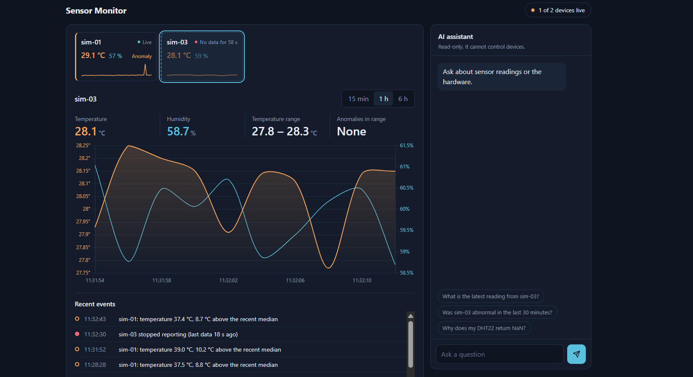
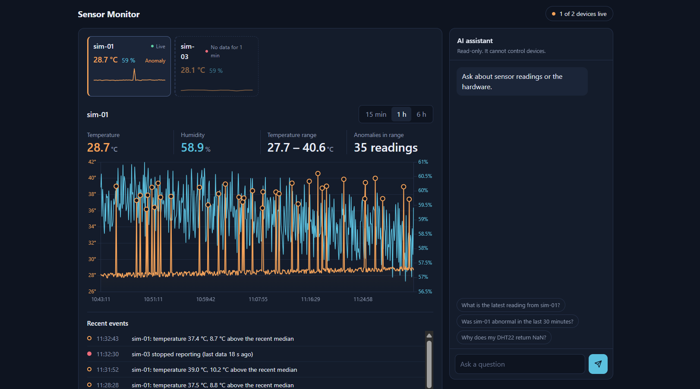
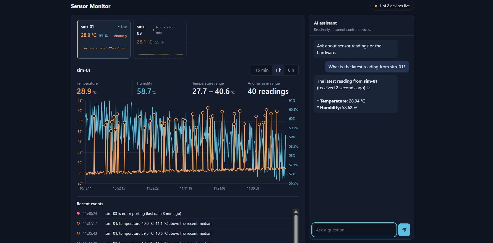

# Secure IoT Sensor Dashboard

A lightweight IoT telemetry pipeline where **every device is a cryptographically verified identity**. Simulated ESP32-style devices publish sensor readings over MQTT with mutual TLS, a Rust backend stores them in SQLite, and a web dashboard charts them in near real time. A built-in AI assistant answers questions about live sensor data and the hardware, using read-only tools and a small documentation search.

The focus of this project is **machine identity and access management**: issuing, authorizing, and revoking device credentials, not just moving sensor data around.

> **Status:** Phase 1 (pipeline + dashboard), Phase 2 (device identity) and Phase 3 (AI assistant) are complete and tested. Adversarial testing of the assistant is still pending. See [Roadmap](#roadmap).

## Screenshots

**A device stops reporting.** The `sim-03` card turns dashed with a red status, the header drops to "1 of 2 devices live", and the event list records the outage next to earlier temperature anomalies.



**Anomaly detection over one hour.** Spikes injected by the simulator are circled on the chart and counted above it. Humidity is plotted on its own axis on the right.



---

## Architecture

```
┌──────────────┐  mTLS (8883)   ┌─────────────────────┐   mTLS (8883)   ┌───────────────┐
│ Simulated    │ ─────────────▶ │  Mosquitto broker   │ ──────────────▶ │ Rust backend  │
│ devices      │   publish      │  - client cert auth │   subscribe     │ (ingestor +   │
│ sim-01,      │                │  - topic ACL        │                 │  HTTP API)    │
│ sim-02 ...   │                │  - CRL revocation   │                 └───────┬───────┘
└──────────────┘                └─────────────────────┘                         │
                                                                          ┌─────▼─────┐
                                                           HTTP API       │  SQLite   │
                                              Dashboard ◀──────────────── └───────────┘
                                              (HTML + Chart.js)
```

| Component            | Technology                                                  | Role                                                           |
| -------------------- | ----------------------------------------------------------- | -------------------------------------------------------------- |
| Device simulator     | Python, `paho-mqtt`                                         | Publishes temperature/humidity, occasionally injects anomalies |
| Broker               | Eclipse Mosquitto 2.x                                       | TLS termination, authentication, authorization, revocation     |
| Backend              | Rust (`axum`, `tokio`, `rumqttc`, `rusqlite`)               | MQTT subscriber, SQLite writer, JSON API                       |
| Storage              | SQLite                                                      | Time-series readings (indexed by device and timestamp)         |
| Dashboard            | HTML + Chart.js (single file)                               | Device overview, charts, event list and a chat panel           |
| AI assistant         | Gemini API (function calling), called from the Rust backend | Answers questions using read-only tools                        |
| Documentation search | SQLite FTS5                                                 | Keyword search over hardware docs in `docs/`                   |

### Design choices

- **Lightweight by design.** Native Mosquitto, a single Rust binary, and an embedded SQLite file mean there is no Docker, no database server, and no front-end build step.
- **Simulation first.** Devices are simulated in Python. The topic and payload format is a contract (below), so real ESP32 firmware can replace the simulator without touching any other component.
- **SQLite instead of a time-series DB.** Appropriate for this scale. The storage code is isolated so it can be swapped for TimescaleDB.

### Message contract

| Item      | Value                                                         |
| --------- | ------------------------------------------------------------- |
| Topic     | `devices/<device_id>/telemetry`                               |
| Payload   | `{"temp": <float>, "hum": <float>}`                           |
| Timestamp | Assigned by the backend on receipt (devices do not send time) |

---

## Identity & access model

This section is the core of the project. The concepts map directly onto classic IAM.

| IAM concept    | Implementation                                                                              |
| -------------- | ------------------------------------------------------------------------------------------- |
| Principal      | Each device (`sim-01`, `sim-02`) and the backend (`ingestor`)                               |
| Credential     | X.509 client certificate + private key, one per principal                                   |
| Identity       | Certificate **CN**, exposed to the broker as the MQTT username (`use_identity_as_username`) |
| Trust anchor   | Private CA (`IoT-Dev-CA`)                                                                   |
| Authentication | Mutual TLS: the broker rejects any client without a certificate signed by the CA            |
| Authorization  | Mosquitto ACL bound to the CN (least privilege)                                             |
| Provisioning   | Issue a key + CSR, sign it with the CA                                                      |
| Deprovisioning | Revoke the certificate and publish a CRL                                                    |

### Authorization rules (`mosquitto/acl.conf`)

```
user ingestor
topic read devices/+/telemetry

pattern write devices/%u/telemetry
```

- Devices can **only publish** to `devices/<their own CN>/telemetry`.
- Devices have **no read access** at all.
- The `ingestor` can **only read** telemetry topics.
- `%u` resolves to the CN, so adding a device requires no ACL change.
- Anything not explicitly allowed is denied.

### Threat model

| Threat                                                  | Mitigation                                                                                          |
| ------------------------------------------------------- | --------------------------------------------------------------------------------------------------- |
| Unknown client connects to the broker                   | No plaintext listener; `require_certificate true` rejects clients without a CA-signed cert          |
| A device impersonates another device                    | Identity is bound to a certificate; forging a CN requires the CA key or the victim's private key    |
| A compromised device writes into another device's topic | ACL `pattern write` limits each CN to its own topic. Blast radius is one topic                      |
| A compromised device snoops on other devices            | Devices have no read permission                                                                     |
| Decommissioned or stolen device keeps connecting        | Certificate revoked via CRL; new connections are refused                                            |
| Malformed or hostile payloads                           | Backend parses into a typed struct (`serde`); invalid messages are logged and dropped, never stored |
| Eavesdropping / tampering in transit                    | TLS 1.2 on the only listener (8883)                                                                 |

### Verified by test

These were run against the live broker:

1. **No client certificate** → connection rejected.
2. **`sim-01` publishes to its own topic** → accepted and stored.
3. **`sim-01` publishes to `devices/sim-02/telemetry`** → denied by the ACL; the broker logs the denial and the message never reaches the subscriber.
4. **`sim-02` certificate revoked** → `openssl verify -crl_check` reports `certificate revoked`, and new connections using it are refused, while `sim-01` and the `ingestor` continue to work unaffected.

### Known limitations

Stated openly, because they define the boundary of this design:

- **CRL does not terminate existing sessions.** A revoked device that is already connected stays connected until it disconnects. Restarting the broker (or using Mosquitto's dynamic security plugin) is required to force it off.
- **CRL must be regenerated** before its validity window (30 days) expires, otherwise validation can fail. Run `scripts/gen-certs.sh crl` and restart the broker; there is no automatic refresh yet.
- **Private keys are plain files.** There is no secure element or hardware-backed key storage, so on a real device a key could be extracted. Production hardware should use a secure element (e.g. ATECC608) or the ESP32's flash encryption and secure boot.
- **Certificate lifetime is 365 days with no automated renewal.** Rotation is manual.
- **The CA key lives on the same machine.** In production it would be kept offline or in an HSM.
- **`pattern write` applies to every user**, so the `ingestor` technically gains write access to `devices/ingestor/telemetry`. Harmless here, but a stricter design would split device and service topic namespaces.
- **Devices do not send timestamps**, so ordering reflects arrival time, not measurement time.
- **Development-grade certificates:** the broker certificate is issued for `localhost` only. Set `BROKER_CN` and `BROKER_SAN` when running the script to change that.

---

## Dashboard

A single static page (`frontend/index.html`, vanilla JavaScript plus Chart.js) served by the backend. It polls the JSON API every 5 seconds and needs no build step.

| Area          | What it shows                                                                                                                                                                                                              |
| ------------- | -------------------------------------------------------------------------------------------------------------------------------------------------------------------------------------------------------------------------- |
| Status pill   | How many known devices are live, for example "1 of 2 devices live" (green: all, amber: some, red: none)                                                                                                                    |
| Device cards  | One per device: latest temperature and humidity, a 15-minute sparkline, and a state. A dashed border means no recent data; an amber left border means an anomaly in the last 15 minutes. Selecting a card drives the chart |
| Chart         | Temperature (left axis) and humidity (right axis) for the selected device over 15 minutes, 1 hour or 6 hours. Anomalies are circled                                                                                        |
| Readouts      | Latest values, temperature range, and the number of anomalous readings in the selected range                                                                                                                               |
| Recent events | Anomalies, devices that stopped or resumed reporting, and newly seen devices                                                                                                                                               |
| Chat panel    | The [AI assistant](#ai-assistant)                                                                                                                                                                                          |

### How "anomaly" and "live" are defined

- **Anomaly:** a temperature more than 5 °C away from the median of the window it is measured in (the selected range for the chart, the last 15 minutes for cards and events). This is a simple heuristic, not a statistical detector, and it is tuned to the simulator's injected spikes of +8 to +12 °C. Adjust `SPIKE` in `index.html`.
- **Live:** the latest reading arrived within the last 15 seconds (`LIVE_SECONDS`). The simulator publishes about every 2 seconds, so change both values together if you change that interval.
- Long ranges are downsampled to about 500 points for drawing. Anomalies are always kept, and the statistics use the full data.

### Dashboard limitations

- Events are derived in the browser and are not stored. Reloading rebuilds them from the last 15 minutes of data, so older outages disappear.
- Every refresh requests 15 minutes of readings for each device. That is fine for a handful of devices; a larger fleet would need a summary endpoint on the backend.
- The page loads Chart.js from a CDN, so the first load needs internet access. For offline use, vendor the library into `frontend/` and embed it.
- The page has no authentication and the backend listens on `127.0.0.1` only.

---

## AI assistant

The dashboard has a chat panel backed by `POST /api/chat`. Example questions: "What is the latest temperature of sim-01?", "Was sim-01 abnormal in the last 30 minutes?", "ESP32 ใช้ ADC ตอนเปิด WiFi ได้ไหม".



The reply comes from a tool call, not from the model's memory: its values (28.94 °C and 58.68 %, received 2 seconds earlier) match the `sim-01` card and readouts, which show the same numbers rounded.

### How it works

The model never sees the database and never writes SQL. It can only ask the backend to run a fixed set of functions (function calling), and the backend validates every argument and runs the query.

| Tool                 | Purpose                                                                      |
| -------------------- | ---------------------------------------------------------------------------- |
| `list_devices`       | Devices that have reported data                                              |
| `get_latest_reading` | Latest temperature/humidity of one device, plus the reading's age in seconds |
| `get_summary`        | Count, min, max, average over the last N minutes (1 to 1440)                 |
| `search_docs`        | Keyword search over the documentation in `docs/`                             |

The assistant is instructed to state only numbers that came from a tool, to report how old the latest reading is (a stale value suggests an offline device), and to answer hardware questions only from `search_docs` results, naming the source file. If the documentation does not cover a question, it says so.

### Documentation search (lightweight RAG)

Markdown files in `docs/` (DHT22, ESP32, and this system's own design) are split into chunks by `##` heading and indexed in a SQLite FTS5 table at startup. Retrieval is keyword-based (BM25 ranking with a Porter stemmer), with no embeddings and no extra service, which keeps memory use minimal.

The documents are in English because the default FTS5 tokenizer cannot segment Thai. The assistant converts the user's question (in any language) into English keywords before searching and answers in the user's language.

### Safety design

- **Read-only.** Every tool is a parameterized `SELECT` or a documentation lookup. There is no tool that writes data or controls a device.
- **Model output is untrusted input.** Device IDs from the model must match a strict pattern and must exist in the database; `minutes` is clamped; search queries are reduced to alphanumeric terms before reaching FTS5, so FTS5 operators cannot be injected.
- **Bounded cost.** At most 3 tool rounds per question and at most 4 tool calls per round; message length is capped at 1000 characters.
- **Data is not instructions.** The system prompt tells the model to ignore instructions appearing in tool results or documentation. The only device-controlled text that reaches the model is the device ID, which is pattern-filtered and tied to the certificate CN by the broker ACL. Sensor values are numbers.
- **No HTML from the model.** The chat panel renders replies with `textContent` and manually created `<strong>` elements, never `innerHTML`, so a manipulated reply cannot inject script into the page.
- **Errors do not leak.** Upstream error details are logged on the server; the client receives a generic message.
- **Secrets stay in the environment.** The API key is read from `GEMINI_API_KEY` and sent in a request header, not in the URL or in any file.
- **Provider isolation.** All LLM calls live in `backend/src/llm.rs`, so the provider can be swapped without touching the rest of the code.

### Assistant limitations

- **Prompt-injection resistance is not yet tested.** The design above reduces the attack surface, but a prompt-injection test (a poisoned document and hostile device IDs) has not been run. Prompt-level defenses are probabilistic, not guaranteed.
- **No authentication on `/api/chat`.** The backend binds to `127.0.0.1` only. Exposing it to a network would let anyone consume the LLM quota; authentication and rate limiting would be required first.
- **No conversation memory.** Each question is answered independently.
- **Free-tier quota.** A question can use 2 to 3 API calls, so the Gemini free tier can return rate-limit errors (reported to the user as HTTP 429 with a retry message). Quotas apply per Google Cloud project and per model, not per API key, so creating a new key in the same project does not reset them. Check current usage at <https://aistudio.google.com/rate-limit>: per-minute limits clear after about a minute, while a daily limit requires waiting for the daily reset or switching to another model.
- **Free-tier data handling.** Data sent to the free tier of the Gemini API may be used by the provider to improve its products. Only simulated data is sent in this project; do not send sensitive data.
- **Documentation accuracy.** The hardware documents are author-written summaries of manufacturer datasheets. The assistant is only as accurate as those summaries.
- **Keyword retrieval only.** FTS5 matches words, not meaning, so a question phrased with unrelated vocabulary may miss a relevant chunk.
- **Hallucination is mitigated, not eliminated.** Numbers from tools can be checked against `/api/readings`; explanatory text is the model's own wording.

---

## Project structure

```
.
├── backend/              Rust service (MQTT ingestor, HTTP API, assistant)
│   ├── Cargo.toml
│   └── src/
│       ├── main.rs       MQTT ingestor, API routes, chat handler, system prompt
│       ├── llm.rs        Gemini client and tool-calling loop
│       └── tools.rs      Read-only tools and FTS5 documentation search
├── docs/                 Hardware and system documentation indexed for search
│   ├── dht22.md
│   ├── esp32.md
│   └── this-system.md
├── frontend/
│   └── index.html        Dashboard + chat panel (embedded into the backend binary at build time)
├── screenshots/          Images used in this README
├── scripts/
│   └── gen-certs.sh      Certificate authority, device certificates, revocation (CRL)
├── simulator/
│   └── esp32.py          Device simulator
├── mosquitto/
│   ├── mosquitto.conf    Broker config (contains absolute paths for your machine, see step 3)
│   └── acl.conf          Topic ACL
├── certs/                Generated locally. Private keys are NOT committed
└── .gitignore
```

---

## Getting started

### Prerequisites

- [Mosquitto 2.x](https://mosquitto.org/download/)
- [Rust toolchain](https://rustup.rs) (`cargo`)
- Python 3.9+
- OpenSSL 1.1.1 or newer (on Windows, use Git Bash, which bundles it; macOS's built-in LibreSSL has not been tested, so install OpenSSL with Homebrew)
- A browser with internet access on first load (Chart.js comes from a CDN)

### 1. Python environment

```bash
python -m venv venv
# Windows: venv\Scripts\activate    |  Linux/macOS: source venv/bin/activate
python -m pip install "paho-mqtt>=2"
```

### 2. Generate certificates

```bash
bash scripts/gen-certs.sh
```

This creates, in `certs/` (set `CERT_DIR` to change it):

- a private certificate authority (`ca.key`, `ca.crt`)
- the broker certificate `broker.crt`, valid for `localhost` and `127.0.0.1`
- client certificates for `sim-01`, `sim-02` and `ingestor`, where the CN is the device identity
- an empty certificate revocation list, `crl.pem`

It finishes by printing the absolute paths to use in the Mosquitto config. Running it again is safe: existing files are never overwritten. Certificates are issued with `openssl ca`, so each one is recorded in the CA database (`certs/index.txt`) and can be revoked later.

Other commands: `issue NAME...` (add devices), `revoke NAME`, `crl` (regenerate the list), `status` (show active and revoked certificates), `help`. On Windows run it from Git Bash; the script disables Git Bash's path rewriting itself, so no `//CN=` workaround is needed.

### 3. Configure and start the broker

Create `mosquitto/mosquitto.conf`. Use **absolute paths** for the certificate files, since Mosquitto does not resolve them relative to your working directory on Windows. Use forward slashes and ASCII only (no non-ASCII characters in config files).

```
listener 8883
protocol mqtt

cafile /ABSOLUTE/PATH/certs/ca.crt
certfile /ABSOLUTE/PATH/certs/broker.crt
keyfile /ABSOLUTE/PATH/certs/broker.key
crlfile /ABSOLUTE/PATH/certs/crl.pem

tls_version tlsv1.2
require_certificate true
use_identity_as_username true

allow_anonymous false
acl_file /ABSOLUTE/PATH/mosquitto/acl.conf
```

`crlfile` can stay in the config from the start, because the script always creates `crl.pem`. Mosquitto refuses to start if the file it points to is missing.

Start it and leave it running:

```bash
mosquitto -c mosquitto/mosquitto.conf -v
```

On Windows PowerShell use `& "C:\Program Files\mosquitto\mosquitto.exe" -c mosquitto\mosquitto.conf -v`. You should see only port **8883** opened.

### 4. Start the backend

```bash
cd backend
cargo run
```

Expect `Listening on http://127.0.0.1:8000` and `MQTT connected`. The backend reads its certificates from `../certs/`, so run it from inside `backend/`. The first build takes a few minutes.

### 5. Start simulated devices

From the project root, in a shell with the venv active:

```bash
python simulator/esp32.py sim-01
python simulator/esp32.py sim-02
```

Open <http://localhost:8000>. Each device appears as a card within a few seconds. Run each device name in only one terminal: MQTT client IDs must be unique, and a second process with the same name will keep disconnecting the first.

**Adding a device** means provisioning an identity for it. Issue a certificate whose CN is the new name with `bash scripts/gen-certs.sh issue sim-03`, then run `python simulator/esp32.py sim-03`. No ACL or broker change is needed because the ACL uses the CN as a pattern.

**If a device never shows up,** check the broker log for `New client connected ... as <name>`. The simulator keeps printing readings even when its connection is refused (the MQTT client retries silently in the background), so printed output does not prove delivery. A revoked certificate, a missing certificate file, or a mistyped name are the usual causes.

### 6. Enable the AI assistant (optional)

The assistant needs a Gemini API key from [Google AI Studio](https://aistudio.google.com) (the free tier works). Set it, together with the model ID, in the same shell that runs the backend, before `cargo run`:

```bash
# PowerShell
$env:GEMINI_API_KEY = "your-key"
$env:GEMINI_MODEL   = "model-id"      # without the "models/" prefix

# bash
export GEMINI_API_KEY="your-key"
export GEMINI_MODEL="model-id"
```

List the models available to your key:

```powershell
$h = @{ "x-goog-api-key" = $env:GEMINI_API_KEY }
(Invoke-RestMethod -Headers $h -Uri "https://generativelanguage.googleapis.com/v1beta/models?pageSize=200").models |
  Where-Object { $_.supportedGenerationMethods -contains "generateContent" } | Select-Object name
```

Pick a current text model from the Flash family. Model names and free-tier availability change over time, so check Google's documentation. If the variables are missing the backend still runs, with chat disabled. Never commit the key. The backend reads `docs/` at startup, so restart it after editing the documentation.

### 7. Try revoking a device

```bash
bash scripts/gen-certs.sh revoke sim-02
bash scripts/gen-certs.sh status       # sim-02 now shows REVOKED
```

The script revokes the certificate, regenerates `crl.pem`, and confirms with `openssl verify -crl_check` that OpenSSL reports it as revoked. **Restart the broker** so it reloads the list. `sim-02` is then refused, while `sim-01` and the backend keep working.

Notes:

- A revoked certificate stays revoked. To bring the name back, delete its `.crt` and `.key` files and run `issue` again; the new certificate gets a new serial number.
- The list expires after 30 days (`CRL_DAYS`). Run `bash scripts/gen-certs.sh crl` and restart the broker before then.

---

## Demo walkthrough

A short script that shows the whole system working, useful for a recorded demo:

1. Start the broker, the backend, and two simulators (`sim-01`, `sim-02`). Both appear as live cards and the header reads "2 of 2 devices live".
2. Ask the assistant: "What is the latest reading from sim-01?" The reply should match the card, and the backend log shows a `tool call:` line proving the number came from the database.
3. Ask: "Why does my DHT22 return NaN?" The reply cites `dht22.md`. Ask something the docs do not cover (for example a price) and it should say so instead of guessing.
4. Stop one simulator with Ctrl+C. Within about 15 seconds its card turns dashed, the header turns amber, and an "outage" event appears. Start it again to see the "reporting again" event.
5. Prove authorization: publish to another device's topic using `sim-01`'s certificate (the result is listed under [Verified by test](#verified-by-test)). The broker log shows a denied publish, and nothing appears for `sim-02`.
   ```bash
   mosquitto_pub -h localhost -p 8883 \
     --cafile certs/ca.crt --cert certs/sim-01.crt --key certs/sim-01.key \
     -t "devices/sim-02/telemetry" -m '{"temp":99,"hum":1}'
   ```
   The publisher itself sees no error at QoS 0, so check the broker log. On Windows, call `mosquitto_pub.exe` by its full path if it is not on `PATH`.
6. Revoke a device (step 7 above), restart the broker, and start its simulator. It is refused while the other devices keep working.

---

## API

| Endpoint                                    | Description                                                                                                                                                                            |
| ------------------------------------------- | -------------------------------------------------------------------------------------------------------------------------------------------------------------------------------------- |
| `GET /api/devices`                          | List of device IDs that have reported data                                                                                                                                             |
| `GET /api/readings?device=<id>&minutes=<n>` | Readings for a device over the last `n` minutes (default 60)                                                                                                                           |
| `POST /api/chat`                            | Body `{"message": "..."}` (1 to 1000 characters). Returns `{"reply": "..."}`. Status codes: 400 invalid message, 429 rate limited, 502 upstream AI error, 503 assistant not configured |

Note: `/api/devices` reads from stored history, so a revoked device still appears (its past data remains) but stops receiving new readings.

---

## Security notes for contributors

- **Never commit private keys.** `.gitignore` should exclude the whole `certs/` directory (keys, serial files, and the CA database).
- The repository does not include working certificates. Generate your own with the steps above.
- Treat device-originated data as untrusted input, especially once it is passed to any language model.
- **Never commit the LLM API key.** Keep it in an environment variable (or an untracked `.env` file listed in `.gitignore`). If a key is ever committed, revoke it and create a new one.

---

License

Copyright (c) 2026 PATTRAPORN RATTANAKANTONG. All rights reserved.

This repository is published for viewing and evaluation only, as a portfolio project. It is not open-source software and is not licensed for use, modification or redistribution. See LICENSE. Third-party dependencies keep their own licenses.
